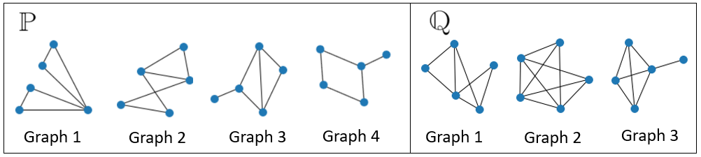

# Summary
In many practical applications, one needs to draw inference from a sample of networks. Kernel methods have proven to be useful in pattern recognition tasks such as classification and can be further extended as an inference procedure to two-sample hypothesis testing on structured data. The method embeds the graphs into a reproducing kernel Hilbert space (RKHS) via a feature map which is then extended further to the embedding of a probability distribution. The two-sample null hypothesis is that the generating mechanism behind the two samples is the same and the test statistic, which is called the maximum mean discrepancy (MMD), is the largest distance between the means of the two sample embeddings. Graph kernels are already well established and widely-used for solving classification tasks on graphs and can further be used to compare samples of graphs and to perform graph screening. They provide a very flexible way of comparing graphs as they exist for a wide range of different graph structures, for example, weighted, directed, labeled and attributed graphs. Their performance depends on their expressiveness, that is, their ability to distinguish non isomorphic graphs. The difficulty of distinguishing two-samples of graphs varies strongly based on the type of graphs. The package provides functions to perform two-sample hypothesis testing using various estimators and various kernels. The package further allows the estimatation of graphs from a real valued data matrix using the graph lasso method.

The workflow is following: 1) Use two data arrays to estimate two sequences/samples of graphs using the graphical lasso [@friedman2008sparse], This step can be skipped if the practisioner already has the samples of graphs in a networkx format [@hagberg2020networkx]. 2) Select a graph kernel. 3) Select an estimator of the MMD or try multiple estimators to obtain a p-value.

# Brief Introduction to the problem of Graph Two-Sample Testing

Let $G(V,S)$ denote a graph with vertex set $V$ and edge set $S$. In the two-sample testing of graph-valued, we assume we are given two sets of samples/observations that comprise collections of graph-valued data $\{G_1,...,G_{n}\}$ and $\{G'_1,...,G'_{n'}\}$ where $G_i, G'_j \in \Omega, \quad \forall i,j$. The graphs in the two samples are all generated independently from two probability spaces $(\Omega, \mathcal{F}, P)$  and $(\Omega, \mathcal{F}, Q)$, and the goal is to infer whether $P=Q$. 

It is worth pausing for a moment to inspect the probability spaces more closely. In the simplest case, the sample space $\Omega$ contains all possible edges that can occur in a graph $G$, that is $\Omega = \{ (v_1, v_2), \dots, (v_1, v_{|V|}), (v_2, v_1), \dots, (v_{|V|}, v_{|V|-1}) \}$ \footnote{We are assuming that a node can not be connected to itself}. As the sample space is discrete we can define the $\sigma$-algebra as the power set of $\Omega$, namely, $\mathcal{F} = \mathcal{P}(\Omega)$. The probability function $P: \mathcal{F} \mapsto [0,1]$ then defines the probability of obtaining a certain graph in the sample set of graph-valued data. As an example we can define for instance a population distribution to be uniform  $P(G(V,S)) = \frac{1}{{M \choose |S|}}$ where $M = {|V| \choose 2}$ is the total number of possible edges and $G(V,S)$ is a graph with $|V|$ vertices and $|S|$ number of edges.  This setting is illustrated in figure \autoref{fig:two_sample_testing}

  

Now, returning to the concept of two sample testing for graph valued data. The goal is to infer whether the two samples of graphs are generated according to the same distribution. This involves developing a statistical test $T(\{ G\}_{i = 1}^n,\{ G'\}_{i = 1}^{n'})$ to determine from the population samples whether there is sufficient evidence to reject a null that both population distributions generating the two samples of graphs are equivalent, where $T(\{ G\}_{i = 1}^n, \{ G'\}_{i = 1}^{n'}): \mathcal \{ G\}_{i = 1}^n \times \{ G'\}_{i = 1}^{n'} \mapsto \{0,1\}$ is a function that distinguishes between the null hypothesis and the alternative hypothesis:

$$
\begin{split}
    H_0:\quad & P = Q \\
    H_1:\quad & P \neq Q.
\end{split}
$$

The test statistic used in this case is the largest distance between expectation of some function w.r.t. to the two probability distributions. Let $\mathcal{H}_B$ be a class of functions $f: \Omega \to R$. The maximum mean discrepancy (MMD) is defined as:

$$
\text{MMD}[\mathcal{H}_B,P, Q] := \sup_{f \in \mathcal{H}_B} \big( E_{G \sim P}[f(G)] - E_{G' \sim Q}[f(G')] \big).
$$

When the class of function, $\mathcal{H}_B$, is the unit ball in a RKHS, denoted as $\mathcal{H}_B$, then the squared population MMD becomes:

$$
\begin{split}
   \text{MMD}^2[\mathcal{H}_1, {P}, {Q}] &=E_{P, P}[k(G,G)] - 2E_{P, Q}[k(G,G')] + E_{Q, Q}[k(G',G')],
    \end{split}
$$

where $k$ is some graph kernel. Finally unbised, biased, and robust estimators of $ \textrm{MMD}^2[\mathcal{H}_1, {P}, {Q}]$ along with a permutation sampling are used to estimate a p-value for the statistical test [@Gretton2012][@MONK].

# Statement of need

Graph two-sample hypothesis testing is a problem that frequently arises in variuous disciplines, for example in bioinformatics [@bassett2008hierarchical], community detection [@girvan2002community], and risk management [@carreno2017identifying]. Graph two-sample hypothesis have mostly been performed by using graph statistics such has the degree centrality and shortest paths. Although theses method can often give good performances they fail to take into account various attributes that are often present in real graphs such as node labels, edge labels, node attributes and edge weights. When the kernel two-sample hypothesis testing was introduces [@Gretton2012] a flood gate opened to allow for testing of such attributes and therefore providing a flexible way of performing two-sample hypothesis testing. Luckily, there also exists a  vast literature on graph kernels [@Kriege2020] [@Nikolentzos2019]. Until now, there is no package which allows one to estimate graphs from real valued data matrices and perform hypothesis testing in a flexible manner. The package provides three functionalities 1) Functions to estimate the two-sample hypothesis test statistic, 2) Functions to calculate different graph kernels and 3) A function to estimate graphs from data matrices. The package allows other network science researches who may not be programmes to use the MMD testing framework. 

The code was orignally used in a paper CITE OUR PAPER to compare pairwise asset return process relationships to study and understand risk and return in portfolio management practice. This allows one to statistically test for significance of any detected differences in portfolio diversification between any portfolio investment strategy when applying differing investment screening criteria or optimal investment strategies. We further remark that this package can furhter be used in other fields other than portfolio comparision. For example, the package allows, in a straight forwards manner, comparing different communities detect by community detection algorithms, finding change-point events in graphs, testing for traffic diffrences in traffic networks, and comparing ego-netwroks of entities.

# The MMDGraph package

There exists a python package called GraKel [@JMLR:v21:18-370] which is dedicated to calculating various graph kernels. The package is very user-friendly so the MMDGraph user can use all graph kernels available in the Grakel package. We then allow users to use other kernels not available in GraKel such as: Fast random walk kernels based on ideas from [@Kang2012] along with an additional fast random walk kernel for edge-labeled graphs, 2) The Wasserstein Weisfeiler-Lehman Graph kernel [@Togninalli2019] whose original code was adjusted for the package needs, 3) The Deep Graph kernel [@DK], and 4) The Graph neural tangent kernel [@Du2019] whose original code was adjusted for the package needs. The package assumes that the graphs passed are a networkx object [@hagberg2020networkx]. One can additionally use its own pre-computed kernel to perform tests.

The MMDGraph package allows the user to use 4 different estimates of the MMD, namely the unbiased version $\text{MMD}_u$, the biased version  $\text{MMD}_b$, the unbised computationally cheaper estimate $\text{MMD}_l$, and a robust estimate $\text{MONK}$. The MONK estimator was developed by $\text{MONK}$ and they do provide the code online and in a package environment. However, we have adjusted the code slighlty to allows for robust comparion of samples of different sizes. The MMDGraph then estimates the $p$-value of test by using a bootstrap or a Permutation sampling scheme.

The package also allows for estimating graphs using sklearn's graphical lasso [@sklearn_api]. Additionall preprocessing can be done by using the nonparanormal transform [@liu2009nonparanormal]. The best graph is found by using the EBIC criterio [@Orzechowski2019]

# References
